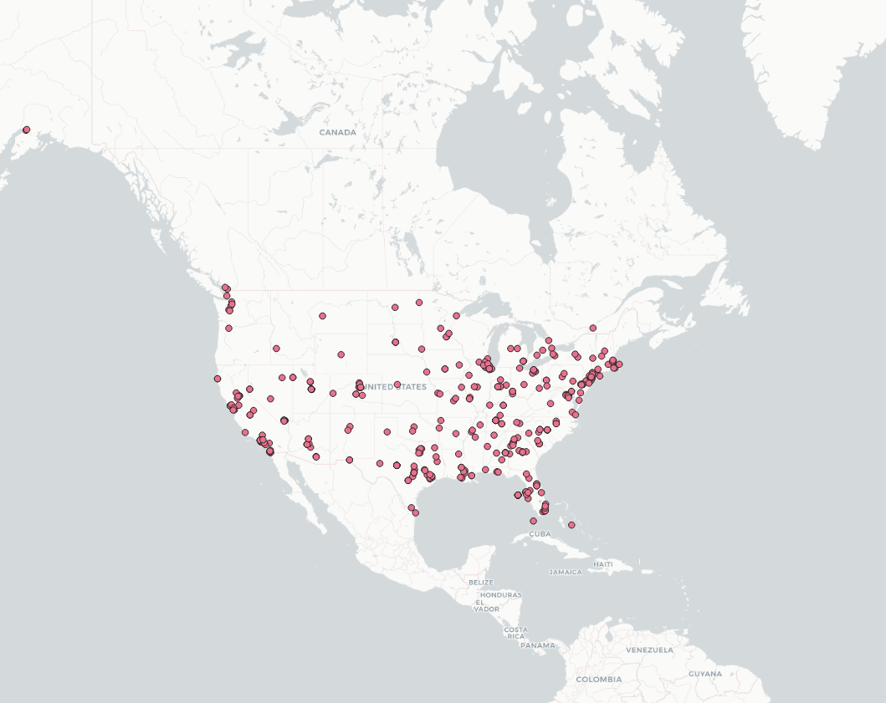
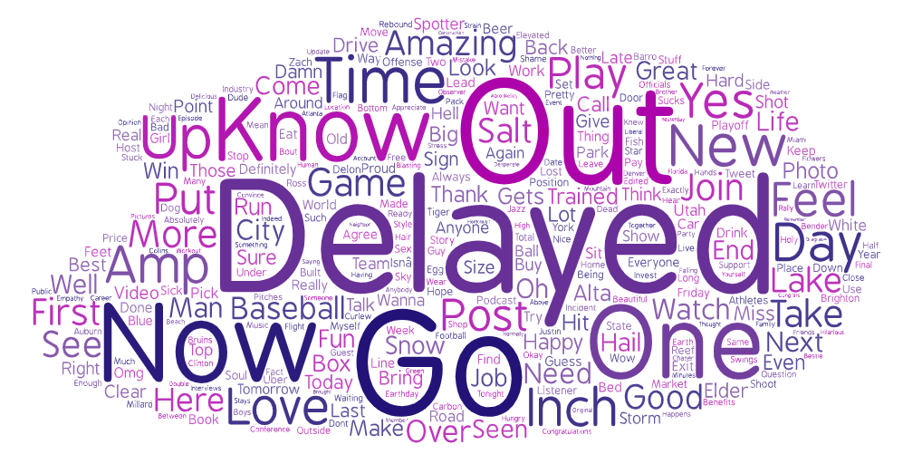

# Read Me

For this assignment, I developed a crawler for geotagged tweets within the United States. I chose to use the same coordinates at two different time stamp: one in the afteroon (roughly around 2PM) and the other around the evening (around 7PM) on the same day. I wanted to compared tweets being made within the same during two different time period because different information/tweets can be gathered since people can have different moods, events, and opinions at different times of the day. 

Based on my location, these maps are geocoded locations where the tweets were made in the afternoon and evening (respectively):

Based on the distribution of tweets, we can see that most tweets in both timestamp were made in the westcoast and eastcoast. One difference (with no definite corrolations or explainations as this was two random times on random days with different events happening) is that in the evening there were more tweets being made in the middle / midwest of the United States.

To better understand what twitter users where tweeting about, I created two word clouds of both time stamp (afternoon and evening respectively):

From the word cloud you can immediately see that some of the most common words tweeted in the afternoon were time, good, see, day, go, etc. Some of the most common words tweeted in the evening were delayed, go, out, now, love, etc. Although the word clouds are not that differentiable between the two timestamp, you can kind of tell or argue that they are two different timestamp. For example, time, good, and go are words that are can be associated during the day (like checking the time, or talking about time, or going somewhere) versus in the evening words like delayed or out (something is delayed because it is the end of the day or people going out after work). 
